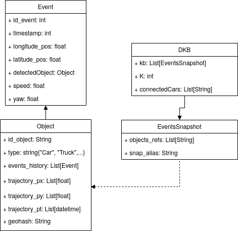

# dataclay-class

This repository contains the file containing the data model and the docker files
to deploy dataClay with the model.

# Build

To build the dockers containing the data model defined below, use the script located in `./build/build_dockers.sh`, which generates the dataclay dockers.

## Model 

<p align="center"></p>


# Deployment

First the exposed dataclay IP should be changed to the IP of your cloud resource, that is, updating the `./deploy/dataclay/docker-compose.yml` file replacing the content of **EXPOSED_IP_FOR_CLIENT=${IP}** by the actual IP.

Then, go to the `./deploy/` folder and execute the script that deploys the dockers:
```
./launch_dockers.sh
```
